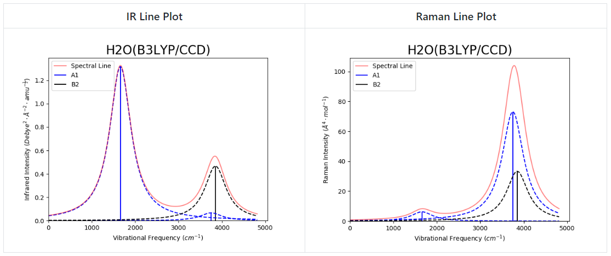

# Summary

The *ab initio* quantum chemistry software GAMESS(US) [@schmidt1993general; @GORDON20051167] is capable of calculating a variety of molecular properties. One of the many popular uses of GAMESS(US) is the prediction of properties of volatile and unstable species that have not been experimentally characterized or quantified before by chemists, physicists, astro-chemists and astro-physicists [@burda2004theoretical; @pacifici2013high; @hickman2005dissociative; @bennett2014experimental]. Applications of, and research done using, GAMESS(US) is not limited to uncharacterized species; it's also widely used in material characterization or material property prediction research. Research utilizing these types of *ab initio* calculations typically require calculations with multiple steps required to achieve each final result. For instance, a Raman activity prediction first requires a geometry optimization and Hessian calculation be performed on the molecule, making automation extremely beneficial. This leads to complicated and tedious workflows slowing a user's research.

Oftentimes single calculations of molecular properties are not reliable, resulting in publications requiring several calculations, each implementing either a different level of theory or basis set, for each property be done on each molecule. This has brought about a demand for high throughput data calculation packages which automate these *ab initio* calculations [@Bhoorasingh; @MATHEW2017140; @Hjorth_Larsen_2017]; as well as workflow management systems [@KROGEL2016154] and data parsers [@o2008cclib]. Specific packages have also been developed to compliment GAMESS(US) [@schaftenaar2000molden; @schmidt2013webmo; @bode1998macmolplt; @allouche2011gabedit; @dermardirossian2005gdis]. However, because these programs are largely visualization and graphical programs, there is still a need for packages that automate GAMESS(US) Raman calculations. Automation is essential to generate large databases of Raman data, which could have further applications for machine learning of Raman data. As it stands, the automation of Raman calculations is either not being done, or being implemented individually by each research group utilizing the GAMESS(US) software. This slows scientific progress down, and an automation software written in a language extremely simple and well adopted by scientists, such as Python, is an attractive solution to the problem.

AutoGAMESS provides an open source, Python-based software for automating conversion between optimization calculations to Hessian calculations and then to Raman calculations. It also offers automation of data collection from the output files, for quick tabular data readouts of each calculation. AutoGAMESS has currently been used for a study presented at the 30th Annual Conference on Computation Physics CCP2018 that will be published in the conference proceedings. AutoGAMESS is also currently being used in multiple other computational chemistry projects, soon to be published by scientists at the University of Central Florida.

AutoGAMESS provides the following public interfaces:

* `new_project`: Builds a directory tree for housing input/output files with spreadsheets for collected data.
* `input_builder`: Builds optimization input files based on text file specifications
* `opt2hes`: Converts optimization input files into Hessian input files
* `hes2Raman`: Converts Hessians input files into Raman input files
* `sort_logs`: Sorts GAMESS(US) output files
* `fill_spreadsheet`: Fills in Excel Spreadsheets with data collected from log files
* `get_data`: Collects data from output files
* `make_plot`: Makes a vibrational frequency vs. IR/Raman intensity line plot

# Capabilities

AutoGAMESS is capable of initializing an entire directory with well-organized subdirectories for housing all input and output files. This main directory will also contain spreadsheets that AutoGAMESS is later capable of filling with the data collected from parsing the output files. Once a main directory is initialized, input files can be generated for GAMESS(US) optimization calculations. Requiring only a simple CSV file as input, AutoGAMESS' `input_builder` function can generate thousands of files with any form of internal GAMESS(US) level of theory and both internal and external basis sets.
External basis sets must be a part of EMSL Basis Set Exchange [@feller1996role; @schuchardt2007basis; @EMSL]. This requirement is due to the integration of the EMSL basis set exchange Python package into AutoGAMESS. After the user has run a geometry optimization calculation, AutoGAMESS is able to quickly get the required data from the output to modify the geometry optimization input file into a Hessian calculation input file. Similarly, after a Hessian calculation AutoGAMESS can use the output to quickly generate a Raman calculation input file. Once all calculations a user desires to run have been completed, AutoGAMESS can sort the output files, then parse files for specific molecular properties and fill in the spreadsheets that had been generated initially. All Hessian and Raman data is pulled directly from output files, while geometry optimization properties, such as bond lengths and angles, are calculated by AutoGAMESS. Bond lengths are calculated by using the simple Euclidean distance formula,

$$ D = \sqrt{(x_2 - x_1)^2 + (y_2 - y_1)^2 + (z_2 - z_1)^2}, $$

while bond angles are calculated by first performing a translation on the Cartesian coordinates, of the general form, $P(x,y,z)\rightarrow P'(x-a, y-b, z-c),$ where $(a,b,c)$ are the coordinates of a central atom. Then the angle between two atoms with a third as the origin is found using the equation

$$ A = \arccos{(\hat{V_1} \cdot \hat{V_2})} $$

where $A$ is the bond angle and $\hat{V_1}$ and $\hat{V_2}$ are the normalized position vectors for each atoms location in relation to the modified origin.

AutoGAMESS is also capable of generating line plots of the vibrational frequency vs. IR/Raman intensity. Generated plots will be titled with the molecule name in the file and the theory/basis set used for the calculation. Each symmetry group will be plotted in a different color, from either a default or user-specified color list. The spectral line (sum of line broadening) will also be plotted in red with 50% transparency. Figure 1 shows an example line plot of $\mathrm H_2\mathrm O$ using B3LYP/CCD for the calculation.

AutoGAMESS can also generate scaling factors for vibrational frequencies using the least squares method by @Scott_Radom. This method involves  minimizing the residuals, $\Delta$, given by

$$ \Delta = \sum_i^{\mathrm{all}} (\lambda \omega_i^{\mathrm{theory}} - \nu_i^{\mathrm{expt}})^2, $$

resulting in

$$ \lambda = \frac{\sum_i^{\mathrm{all}} \omega_i^{\mathrm{theory}} \nu_i^{\mathrm{expt}}}{\sum_i^{\mathrm{all}} (\omega_i^{\mathrm{theory}})^2}, $$

where $\omega_i^{\mathrm{theory}}$ and $\nu_i^{\mathrm{expt}}$ are the $i$th theoretical harmonic and $i$th experimental fundamental frequencies (in $\mathrm{cm}^{-1}$) and $\lambda$ is the scaling factor. The root mean square error is then given by

$$ \mathrm{rms} = (\frac{ \sum_i^n \Delta_{\min} }{n} )^{\frac{1}{2}}, $$

where $n$ is the number of frequency modes for the molecule and $\Delta_{\min}$ is the minimized residual for each particular mode.

# Use of AutoGAMESS

AutoGAMESS was developed to be versatile in its usability; several examples (in both shell and Python scripts) can be found in the software's GitHub repository.

# Availability
This software is distributed under the MIT License and can be installed through Python's `pip` install command.

`python -m pip install autogamess --user`

# Dependencies

AutoGAMESS requires all the following Python packages:

* Python-3.x
* NumPy [@oliphant2006guide; @numpy]
* SciPy [@scipy]
* Pandas [@mckinney-proc-scipy-2010]
* basis_set_exchange
* PeriodicElements
* openpyxl
* Matplotlib [@Hunter:2007]

# Acknowledgements

The author would like to thank Dr. Christopher J. Bennett, Remington Cantelas and Sarah Swiersz for helpful discussions while developing the package.

# References
