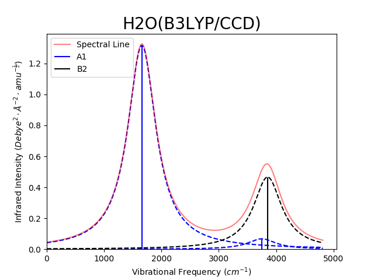
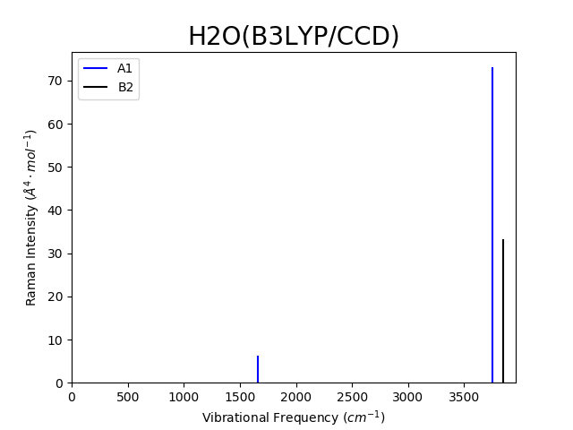

# AutoGAMESS

[](https://doi.org/10.21105/joss.01612)

If you use AutoGAMESS for any published research, please cite it in the following or similar manner:

```
AutoGAMESS[1] was used for workflow automation.

[1] Ferrari, Brian. "AutoGAMESS: A Python package for automation of GAMESS (US) Raman calculations." Journal of Open Source Software 4.41 (2019): 1612.
```

This is a python module for automating  the generation of input files and parsing of log files with end goal of generating Raman data using the [GAMESS(us)](https://www.msg.chem.iastate.edu/gamess/) Quantum Chemistry software.

This package was developed using `GAMESS VERSION = 20 APR 2017 (R1)`, it has also been partially tested for use with `GAMESS VERSION =  1 MAY 2013 (R1)` and `GAMESS VERSION = 14 FEB 2018 (R1)`.

AutoGAMESS is also able to generate line plots of vibrational frequency vs. IR/Raman intensities. Generated plots will be titled with the molecule name in the file and the theory/basis set used for the calculation. Each symmetry group will be plotted in a different color, from either a default or user specified color list. The spectral line (sum of line broadening) will also be plotted in red with 50% transparency. An example is shown bellow using Lorentzian line broadening method with the default sigma option.

IR Line Plot | Raman Line Plot
-------------|----------------
 | 

# Installing AutoGAMESS

AutoGAMESS can be installed using

`python -m pip install autogamess --user`

AutoGAMESS requires all the following Python packages:

* Python3.x
* NumPy
* SciPy
* Pandas
* basis_set_exchange
* PeriodicElements
* openpyxl
* Matplotlib

# Tests

AutoGAMESS uses pytest for testing, from within the tests directory execute the following to run tests.

`python -m pytest`

# Function Documentations

### new_project
**`new_project(maindir,csvfile,initial_coords_dict=None,title='Project_Name/', make_inputs=False)`**

```
This function creates a new directory tree for a GAMESS project, also makes
  a couple of text files for use with other functions.

  Parameters
  ----------
  maindir: string
      A directory string (including the final `/`) that points to the
      directory that the project tree will be spawned in.
  csvfile: string
      A directory string (including the final `.csv`) that points to the
      text file containing project information. Read module documentation
      for csv file format.
  initial_coords_dict: dictionary [Optional]
      This should be a dictionary with the key being the specie and the
      value being a list that of its initial coordinates.
  title: string [Optional]
      A directory string (including the final `/`) that will be used as
      the head of project directory tree.
  make_inputs: boolean True/False [Optional]
      if True then new_project will call input_builder at the end.

  Notes 1
  ----------
  If the molecules you wish to build are not already defined in the
  general autogamess coordinate dictionary, then initial_coords_dict
  must be passed.

  To see the autogamess coordinate dictionary simply print out
  >>> ag.dictionaries.molecule_dictionary

  Returns
  ----------
  This function returns nothing

  Notes 2
  ----------
  The format of the spawned directory tree is as follows:

                                  maindir
                                     |
                                   title
                      -------------------------------------
                      |        |        |        |        |
                    Codes    Inps     Logs  Batch_Files  Spreadsheets
                      |        |        |                     |
                ---------    Block    -----------      1 file per specie
                |       |             |    |    |
          Text_Files  Scripts      Fail   Pass  Sorted
                                    |      |        |
                                 -------  Block   1 directory per specie
                                 |     |
                           Unsolved   Solved


  Sections in directory tree labeled 'Block' are directory trees with the
  following format:
                    1 directory per run type
                                |
                    1 directory per specie

  Examples
  ----------
  >>> import autogamess as ag
  >>>
  >>> csvfile = './input.csv'
  >>> maindir = './'
  >>> title   = 'Project Title/'
  >>>
  >>> ag.new_project(maindir, csvfile, title=title)
  >>>
```

### input_builder

**`input_builder(inputfile, save_dir, initial_coords_dict=None,proj_title=' Your Title Goes Here\n')`**

```
This function builds optimization input files.

Parameters
----------
inputfile: string
    This should be a full directory string that points to the input
    csv file.
save_dir: string
    this should be a full directory string that points to the directory
    you wish to save the inputs in.
initial_coords_dict: dictionary [Optional]
    This should be a dictionary with the key being the specie and the
    value being a list of the symmetry group and symmetry unique atom
    coordinates. Examples can be seen in the AutoGAMESS GitHub repository
    as well as by prinint out the default dictionary, see Notes section.
proj_title: string [Optional]
    This should be a string ending with `\n`

Notes 1
----------
If the molecules you wish to build are not already defined in the
general autogamess coordinate dictionary, then initial_coords_dict
must be passed.

To see the autogamess coordinate dictionary simply print out
>>> ag.dictionaries.molecule_dictionary

Returns
----------
This function returns nothing

Notes 2
----------
This function uses the EMSL Basis Set Exchange module to import
external basis sets[1]. This function also uses the Periodic_Elements
package by VaasuDevanS [2].

[1] https://github.com/MolSSI-BSE/basis_set_exchange
[2] https://github.com/VaasuDevanS/Periodic_Elements


Examples
----------
>>> import autogamess as ag
>>>
>>> csvfile = './input.csv'
>>> savedir = './'
>>> title   = 'Project\n'
>>>
>>> ag.input_builder(csvfile, savedir, proj_title=title)
>>>
```

### opt2hes

**`opt2hes(optfile, logfile)`**

```
This function writes a hessian calculation input file using a previously
run optimization input file and the log file generated by the calculation.

Parameters
----------
optfile: string
    This should be a string that points to the input file of an
    already run optimization file. (FULL DIRECTORY STRING REQUIRED)
logfile: string
    This should be a string that points to the log file of an
    already run optimization file. (FULL DIRECTORY STRING REQUIRED)

Returns
-------
This function returns nothing if it terminates successfully, otherwise
it returns ValueError.

Example
-------
>>> import autogamess as ag
>>>
>>> logfile = './Optimization_Log_Folder/IBv6_NH3_CCSD-T_CC6_opt.log'
>>> optfile = './IBv6_NH3_CCSD-T_CC6_opt.inp'
>>>
>>> ag.opt2hes(optfile, logfile)
>>>
```

### hes2raman

**`hes2raman(hesfile, datfile)`**

```
This function writes a raman calculation input file using a previously
run hessian input file and the dat file generated by the calculation.

Parameters
----------
hesfile: string
    This should be a string that points to the input file of an
    already run hessian file. (FULL DIRECTORY STRING REQUIRED)
datfile: string
    This should be a string that points to the DAT file of an
    already run hessian file. (FULL DIRECTORY STRING REQUIRED)

Returns
-------
This function returns nothing if it terminates successfully, otherwise
it returns ValueError.

Example
-------
>>> import autogamess as ag
>>>
>>> datfile = '../restart/IBv6_NH3_CCSD-T_CC6_hes.dat'
>>> hesfile = './IBv6_NH3_CCSD-T_CC6_hes.inp'
>>>
>>> ag.hes2raman(hesfile, datfile)
>>>
```

### sort_logs

**`sort_logs(projdir, logsdir)`**

```
This function sorts all the loose log files in the 'Logs' directory.

Parameters
----------
projdir: string
    A directory string (including the final `/`) that points to the
    project head directory.
logsdir: string
    A directory string (including the final `/`) that points to the
    directory containing the log files.

Returns
----------
This function returns nothing

Notes
----------
For this function to work properly the project directory tree must be
in the exact format that the 'new_project' function spawned it in.

Examples
----------
>>>import autogamess as ag
>>>
>>>projdir = './Example/'
>>>logsdir = './logs/'
>>>
>>>ag.sort_logs(projdir, logsdir)
>>>
```

### fill_spreadsheets

**`fill_spreadsheets(projdir=False, sorteddir=False, sheetsdir=False)`**

```
This function fills in the spreadsheets initially generated by new_project
with data collected from the outfiles of calculations.

Parameters
----------
projdir: string [Optional]
    This should be a full directory string pointing to the project
    directory initially created by new_project.
sorteddir: string [Optional]
    This should be a full directory string pointing to the sorted log
    files directory.
sheetsdir: string [Optional]
    This should be a full directory string pointing to the spreadsheets
    directory.

Notes
----------
If projdir is not passed to fill_spreadsheets function then both other
parameters MUST be passed to it. Similarly if projdir is passed the
other two parameters MUST be left blank.

Once `fill_spreadsheets` has parsed the data file, it will move the log file
into the `Pass` directory implying that the calculation successfully terminated, or it will move it to `Fail` directory if termination unsuccessful.

Returns
-------
This function returns nothing.

Example
-------
>>> import autogamess as ag
>>>
>>> projdir = './Your Project Title/'
>>>
>>> ag.fill_spreadsheets(projdir)
>>>

>>> import autogamess as ag
>>>
>>> sorteddir = './project/Logs/Sorted/'
>>> sheetsdir = './project/Spreadsheets/'
>>>
>>> ag.fill_spreadsheets(sorteddir=sorteddir, sheetsdir=sheetsdir)
>>>
```

### get_data

**`get_data(filename)`**

```
This function collects data from GAMESS(us) log files.

Parameters
----------
filename: string
    This should be a string that points to the log file of any
    GAMESS(us) calculation. (FULL DIRECTORY STRING REQUIRED)

Returns
-------
data: object
    This is an object with all the data collected from the log file.
    Below is a list of the attributes associated with `data` based on
    each log file type.

    all   files: `cpu`, `time`
    opt   files: `bond_lengths`, `bond_angles`
    hes   files: `vib_freq`, `ir_inten`
    raman files: `raman`
    vscf  files: `vscf_freq`, vscf_ir

Notes
-------
This function is primarily intended for interal use by AutoGAMESS.

Example
-------
>>> import autogamess as ag
>>>
>>> filename = './AGv0-0-6_NH3_CCSD-T_CC6_opt.log'
>>>
>>> ag.get_data(filename)
>>>
```

### make_plot

**`make_plot(file, savedir=None, cmap=['b', 'k', 'r', 'g', 'y', 'c'], method=None, sig=300, flag=[], reverse_x=True)`**

```
This function make vibrational frequency vs. IR/Raman intensity line plots.

Parameters
----------
file: string
    This should be a string that points to the log file of a hessian or
    Raman GAMESS(us) calculation. (FULL DIRECTORY STRING REQUIRED)
savedir: string
    This should be a string that points to the directory in which you
    would like to save the png of the plot.(FULL DIRECTORY STRING REQUIRED)
cmap: list [Optional]
    This should be a list of Matplotlib allowed color choices. Each symmetry
    will be plotted with a different color in the list.
method: string [Optional]
    This should be string giving the method for line broadening, options are
    `Gaussian`, `Lorentzian`, None(defualt).
sig: integer or float [Optional]
    This should be a numerical value to be used as the FWHM for the line
    broadening method chosen. Default: 300 wavenumbers
flag: list [Optional]
    This should be a list of integers, in particular 1,2 and 3. This list
    tells the function what to plot and what to omit from the plot.
    Please see the Notes section for more details.
reverse_x: boolean True/False [Optional]
    if True then x-axis will be in reverse (ie: 300---150----0).

Notes
-------
The `flag` parameter is used as follows:

[Default] `flag=[]`    ---> All lines are plotted
          `flag=[1]`   ---> Vertical lines are not plotted
          `flag=[2]`   ---> Spectral line not plotted
          `flag=[3]`   ---> Gaussian/Lorentzian lines not plotted
          `flag=[1,2]` --->V Vertical lines and Spectral line not plotted

List combination follow the same format, all possible list combinations
are allowed.

Returns
-------
This function returns nothing.

Example
-------
>>> import autogamess as ag
>>>
>>> file    = './AGv0-0-6_NH3_CCSD-T_CC6_hes.log'
>>> savedir = './'
>>>
>>> ag.make_plot(file, savedir)
>>>
>>> cmap = ['b', 'r', 'k', 'c']
>>> ag.make_plot(file, savedir, cmap=cmap)
>>>
>>> method = 'Lorentzian'
>>> sig    = 450
>>>
>>> ag.make_plot(file, savedir, cmap=cmap, method=method, sig=sig)
>>>
```

### generate_scaling_factors

**`generate_scaling_factors(projdir, expt_dict, species, method='scott')`**

```
This function generates scaling factors and scaled frequencies.

Parameters
----------
projdir: string
    This should be a full directory string pointing to the project
    directory initlly created by new_project.
expt_dict: dictionary
    This should be a python dictionary with the experimental frequency
    values for all species that the user wants to generate scaling factors
    for in it. Format is explained in Notes section.
species: list
    This should be a list of all species the user would like scaling factors
    generated for. Any molecule in the list must have experimental data in
    the `expt_dict` associated with it.
method: string [Optional]
    This should be string giving the method for scaling factor calculation,
    options are `scott`(defualt).

Notes
-------
`expt_dict` format should be as follows:

        {`specie`: [`nu_1`, `nu_2`, ... , `nu_N`]}

 where `specie` must be written the same way as the Excel spreadsheet file
 for that molecule is written. Each frequency, `nu`, should be given in
 the same order as they appear (left to right) in the spreadsheet.

 `species` list format can be in any order but must adhere to the rule
 that any element in `species` is a key for `expt_dict`

 Once execution of this function is completed the `Hessian` worksheet
 will be updated to have a coulmn giving `Scaling Factor/RMS`, as well
 as the scaled frequencies will appear in parathesis next to the predicted
 frequencies.

Returns
-------
This function returns nothing.

Example
-------
>>> import autogamess as ag
>>>
>>> projdir   = './Your Project Title/'
>>> expt_dict = {'H2O': [1595, 3657, 3756]}
>>> species   = ['H2O']
>>>
>>> ag.generate_scaling_factors(projdir, expt_dict, species)
>>>
```

# Input Descriptions
All user functions contain doc strings with examples and explanations of parameters and returns. However, a few functions require specific inputs not fully explained in the doc strings. Such as the functions:
* new_project
* input_builder

The CSV file required by both functions must have the following format. The first line must be the header, written exactly as follows.

| Species | Theory | Composite Methods | Basis Sets | External Basis Sets | Run Types |
| ------- | ------ | ----------------- | ---------- | ------------------- | --------- |

All lines after the header should give input as 1 item per column per line. As shown in the example bellow.

| Species | Theory  | Composite Methods | Basis Sets | External Basis Sets | Run Types    |
| ------- | ------  | ----------------- | ---------- | ------------------- | ---------    |
| H2O     | B3LYP   | G32CCSD           | CCD        | may-cc-pVQZ         | Optimization |
| NH3     | MP2     | G4MP2             | CCT        | aug-cc-pV7Z         | Hessian      |
| HCN     | CCSD-T  | G4MP2-6X          | CCQ        | may-cc-pVTZ         | Raman        |
| H2CO    | PBE     | CCCA-S4           | CC5        | Sadlej-pVTZ         | VSCF         |
| CH4     | wB97X-D | CCCA-CCL          | CC6        | jun-cc-pVQZ         |              |
| C2H6    | SCS-MP2 |                   | ACCD       | jul-cc-pVTZ         |              |
| C2H4    | CCSD2-T |                   | ACCT       |                     |              |
| C2H2    |         |                   | ACCQ       |                     |              |

AutoGAMESS assumes the user will be performing every possible combination of
Theory and Basis Sets(internal and external) for every calculation type, across
all species. Therefore repetition within columns will cause an error. If a user wishes to perform Optimization, Hessian and Raman calculations on water(H2O) using only B3LYP CCD the following should be in the CSV.

| Species | Theory  | Composite Methods | Basis Sets | External Basis Sets | Run Types    |
| ------- | ------  | ----------------- | ---------- | ------------------- | ---------    |
| H2O     | B3LYP   |                   | CCD        |                     | Optimization |
|         |         |                   |            |                     | Hessian      |
|         |         |                   |            |                     | Raman        |

For any given CSV file the total generated input files by `input_builder` will be
`n*m*i` where *n* is the number of Species given, *m* is the number of Theory given, and *i* is the number of Basis Sets given.

Internal basis sets should be written in the same format as they are required by GAMESS(us) inputs.

External basis sets should be written in the same format as they as required by ESML [basis_set_exchange](https://github.com/MolSSI-BSE/basis_set_exchange). Some external basis sets have shorthand names built into AutoGAMESS to prevent special characters such as `(, ), +, etc.` from being put into file names. Notice this is applicable to `may-cc-pV(D+d)Z` written simply as `may-cc-pVDZ` similarly for the other calendar basis sets.

initial_coords_dict is another input parameter that requires specific formatting. The dictionary is meant to give the initial guess coordinates for a particular symmetry of a molecule. This should be a python dictionary that has the Species (molecule) name as the key and a list with the following format.

```python
key = 'H2O'

value = ['CnV 2,\n','\n',
         ' O           8.0  -0.0000000000   0.0000000000  -0.0123155409\n',
         ' H           1.0  -0.0000000000  -0.7568005555   0.5926935705\n']

initial_coords_dict = {key : value}
```

Note that the atoms given in the list are the symmetry unique atoms for the point group symmetry given in the first element of the list. Point group symmtery should be given in GAMESS(us) format, with the second element of the list being `\n` for cases where GAMESS(us) requires a blank card after the symmetry group. For symmetry groups that cannot have a blank card after in GAMESS(us) the second element should be the first symmetry unique atom. Finally, make sure all elements of the list end with `\n` to ensure they are written in separates lines.

Some molecules are already compiled within AutoGAMESS default dictionary however, if one of the molecules in the input CSV file is not within the default dictionary a complete dictionary with all molecules within the CSV file is required by AutoGAMESS.

# Examples of Common AutoGAMESS Utilization Methods

### Compile Existing Data

A basic script for generating a new project directory, sorting already existing logs into it, then filling the spreadsheets with the data in the existing output files. For this script to work properly, file names must adhere to the AutoGAMESS file naming convention

`[arbitrary thing]_[Specie]_[Theory Level]_[Basis Set]_[Abbreviated Run Type].[inp/log/dat]`

An example is “AG-test_H2O_B3LYP_CCD_opt.log”, where the Arbitrary Thing is `AG-test`, Specie is `H2O`, Theory Level is `B3LYP`, Basis Set is `CCD` and the Abbreviated Run Type is `opt`.

The 'arbitrary thing' section can be anything, since this is typically where AutoGAMESS will write the version number. Since AutoGAMESS reads information from file names and requires the underscore separates the information something must be present there to prevent confusion. If the file name format is incorrect the `fill_spreadsheets` function will be unable to map the data to the correct cell in the spreadsheet. However, the `get_data` function only requires the abbreviated run type be written with underscore before and file extensive following it (ie: `..._opt.log`). The Abbreviated Run Types are,

`Optimization = opt`

`Hessian = hes`

`Raman = raman`

`VSCF =  vscf`

```python
import autogamess as ag

maindir = './'
csvfile = './input.csv'
title   = 'Project Title/'

ag.new_project(maindir, csvfile, title=title)

projdir = maindir + title
logsdir = './Logs/'

ag.sort_logs(projdir, logsdir)

ag.fill_spreadsheets(projdir)
```

### Converting Input Files

A basic script for converting all files within a directory into their next calculation type. Also separates the files that GAMESS(us) calculation did not terminate successfully.

```python
import os
import autogamess as ag

idir = './inps/'
ldir = './logs-dats/'
done = './done/'
fail = './failed/'
iext = '.inp'
lext = '.log'
dext = '.dat'

for file in os.listdir(ldir):
    if lext not in file:
        continue

    if '_opt' in file:     
        inp = idir + file.replace(lext, iext)
        dat = ldir + file.replace(lext, dext)
        log = ldir + file
        try:
            ag.opt2hes(inp, log)
        except:
            os.rename(inp, inp.replace(idir, fail))
            os.rename(log, log.replace(ldir, fail))
            os.rename(dat, dat.replace(ldir, fail))
            continue
        os.rename(inp, inp.replace(idir, done))
        os.rename(log, log.replace(ldir, done))
        os.rename(dat, dat.replace(ldir, done))

    if '_hes' in file:
        inp = idir + file.replace(lext, iext)
        dat = ldir + file.replace(lext, dext)
        log = ldir + file
        try:
            ag.hes2raman(inp, dat)
        except:
            os.rename(inp, inp.replace(idir, fail))
            os.rename(log, log.replace(ldir, fail))
            os.rename(dat, dat.replace(ldir, fail))
            continue
        os.rename(inp, inp.replace(idir, done))
        os.rename(log, log.replace(ldir, done))
        os.rename(dat, dat.replace(ldir, done))
```

### Data Parsing Log Files

A less common method of utilizing AutoGAMESS is to parse any single output file for data. The get_data function which is typically meant to be an internally used function can be called by the user. This will retrieve the data from the file, it will read the file name to get the run type.

```python
import autogamess as ag

file = 'AG-test_H2O_B3LYP_CCD_opt.log'

data = ag.get_data(file)

lengths = data.bond_lengths
angles  = data.bond_angles
```

### Generating Scaling Factors

To generate scaling factors for all Hessian calculations that have been compiled by `fill_spreadsheets` you just need to call `generate_scaling_factors`. Here is an example considering the molecule in question is H2O.

```python
import autogamess as ag

projdir   = './Your Project Title/'
expt_dict = {'H2O': [1595, 3657, 3756]}
species   = ['H2O']

ag.generate_scaling_factors(projdir, expt_dict, species)
```

### Making Plots

Make plots with AutoGAMESS is quite simple, here are some examples (these examples are also found in the `make_plot` doc string).

This first example is to for having a plot displayed on screen without saving it.

```python
import autogamess as ag

file = 'AG-test_H2O_B3LYP_CCD_opt.log'

ag.make_plot(file)
```

The next example shows how to make and save a plot to the current working directory.

```python
import autogamess as ag

file    = './AGv0-0-6_NH3_CCSD-T_CC6_hes.log'
savedir = './'

ag.make_plot(file, savedir)
```

The next example shows you how to pick your own colors for each symmetry group that is plotted.

```python
import autogamess as ag

file    = './AGv0-0-6_NH3_CCSD-T_CC6_hes.log'
savedir = './'
cmap    = ['b', 'r', 'k', 'c']

ag.make_plot(file, savedir, cmap=cmap)
```

The next example shows how to use line broadening in your plot, in particular this uses the Lorentzian method and a Full Width Half Maximum (FWHM) of 450 wavenumbers.

```python
import autogamess as ag

file    = './AGv0-0-6_NH3_CCSD-T_CC6_hes.log'
savedir = './'
cmap    = ['b', 'r', 'k', 'c']
method = 'Lorentzian'
sig    = 450

ag.make_plot(file, savedir, cmap=cmap, method=method, sig=sig)
```

The next example shows how to use flags to omit certain things from being plotted. Here we are omitting the vertical lines and the dashed liner broadening lines, leaving only the spectral line to be plotted.

```python
import autogamess as ag

file    = './AGv0-0-6_NH3_CCSD-T_CC6_hes.log'
savedir = './'
cmap    = ['b', 'r', 'k', 'c']
method = 'Lorentzian'
sig    = 450
flag   = [1,3]

ag.make_plot(file, savedir, cmap=cmap, method=method, sig=sig)
```
